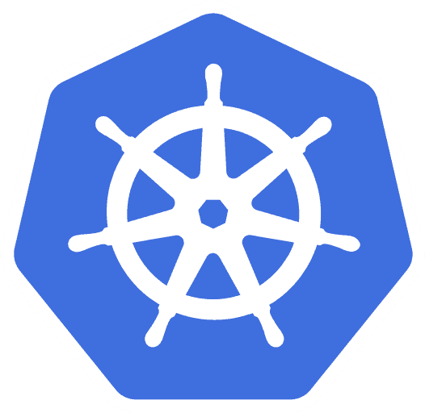

#  JMeter Distributed Environment using Kubernetes
JMeter distributed environment can be created on local system using minikube kubernetes cluster.
This page describes the steps and dependencies to set up the JMeter distributed environment using minikube.

## :oil_drum: Redis Certificate and Key :closed_lock_with_key:
Create certificate and key file by running below command:
```shell
export REPO_DIR="<path\to\apache-jmeter-distributed-testing>"
cd "$REPO_DIR\redis"
openssl req -newkey rsa:2048 -nodes -keyout redis-domain.key -x509 -days 365 -out redis-domain.crt
```
Copy the contents of `redis-domain.key` and `redis-domain.crt` in [jmeter-master configmap](./base/jmeter-master/dev/configmap.yaml)
as well as in [jmeter-server configmap](./base/jmeter-server/dev/configmap.yaml)

## :closed_lock_with_key: Import Redis certificate in Java Keystore
Run below command to import redis db server certificate as trusted certificate in Java keystore:
```shell
export REPO_DIR="<path\to\apache-jmeter-distributed-testing>";
keytool -import -file "$REPO_DIR\redis\redis-domain.crt" \
  -alias redis-server-ca \
  -keystore "$REPO_DIR\k8s\base\jmeter-master\redis-db-ca.jks" \
  -storepass "redis-cert@alpana" \
  -storetype JKS -noprompt
cp "$REPO_DIR\k8s\base\jmeter-master\redis-db-ca.jks" "$REPO_DIR\k8s\base\jmeter-server\redis-db-ca.jks"
```

##  Minikube setup
Run below command to create the minikube k8s cluster:
```shell
export REPO_DIR="<path\to\apache-jmeter-distributed-testing>"
minikube start --memory 10692 --cpus 2 --mount-string="$REPO_DIR:/home/repo" --mount --driver=docker
```

##  Deploy a Kubernetes Service Account in Minikube
Create a Kubernetes service account named `sa-test-automation` in the `ns-test-automation-jmeter-dev` namespace, by running below commands:
```shell
kubectl create ns ns-test-automation-jmeter-dev
kubectl create -n ns-test-automation-jmeter-dev sa sa-test-automation
```

##  Deploy Vault
Kubernetes JMeter pods will fetch secrets from vault, hence it is necessary that vault is up and running before deploying
JMeter master and server pods.

To deploy vault on minikube, follow steps documented on [Vault](./vault/README.md) 

## :ship: JMeter Distributed Environment + :watch: InfluxDB + :chart_with_upwards_trend: Grafana
Run below command to create JMeter distributed environment with InfluxDB and Grafana using kustomize:
```shell
export REPO_DIR="<path\to\apache-jmeter-distributed-testing>"
cd "$REPO_DIR\k8s\base"
kubectl apply -k .
```

Once `redis-svc` is up, redis database can be accessed on `localhost:6379` by running below command:
```shell
kubectl port-forward services/redis-svc 6379:6379 -n redis
```

Once `influxdb-svc` is up, influx database can be accessed on http://localhost:9086/ by running below command:
```shell
kubectl port-forward services/influxdb-svc 9086:8086 -n influxdb
```

Once `grafana-svc` is up, grafana can be accessed on http://localhost:3000/ by running below command:
```shell
kubectl port-forward services/grafana-svc 3000:3000 -n grafana
```

##  Run Test Plan from JMeter Master Container
* Get IP address of JMeter servers, by running below commands:
  ```shell
  export JMETER_SERVER="app.kubernetes.io/name=jmeter-server"
  export JMETER_NAMESPACE="ns-test-automation-jmeter-dev"
  export JMETER_SERVER_IPS=$(kubectl get pods -n $JMETER_NAMESPACE --selector=$JMETER_SERVER -o jsonpath="{.items[*].status.podIP}")
  export REMOT_SERVERS=$(sed 's/ /,/g' <<< "$JMETER_SERVER_IPS")
  ```

* SSH into jmeter-master container, by running below commands:
  ```shell
  export JMETER_NAMESPACE="ns-test-automation-jmeter-dev"
  export JMETER_MASTER="app.kubernetes.io/name=jmeter-master"
  kubectl exec -it \
  $(kubectl get pod --namespace $JMETER_NAMESPACE --selector=$JMETER_MASTER \
  --output jsonpath='{.items[0].metadata.name}') --container jmeter-master -n $JMETER_NAMESPACE -- sh
  ```

* Run below command to execute tests from `jmeter-master` container:
  ```shell
  export REMOT_SERVERS=<copy-paste-value-of-$REMOT_SERVERS>
  export TEST_REPORT_TIMESTAMP=$(TZ='GMT-1' date +%d%m%Y-%H%M%S);
  export TEST_RUN_TIMESTAMP=$(TZ='GMT-1' date +%d.%m.%Y-%H:%M:%S);
  jmeter -n \
    -t /jmeter/repo/tests/sample.jmx \
    -R$REMOT_SERVERS \
    -j /jmeter/repo/logs/sample-minikube-jmeter-master.log \
    -l /jmeter/repo/results/sample-minikube-$TEST_REPORT_TIMESTAMP.csv \
    -Jserver.rmi.ssl.disable=true \
    -G /jmeter/configs/local-minikube-dev.properties \
    -q /jmeter/configs/local-minikube-dev.properties \
    -G /vault/secrets/credentials.conf \
    -q /vault/secrets/credentials.conf \
    -Jtest.runId=R-$TEST_RUN_TIMESTAMP \
    -Ljmeter.engine=DEBUG
  ```